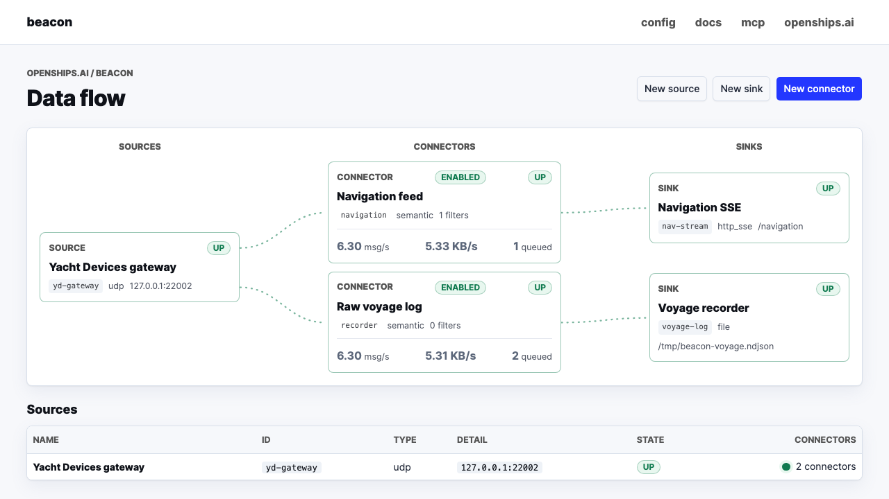
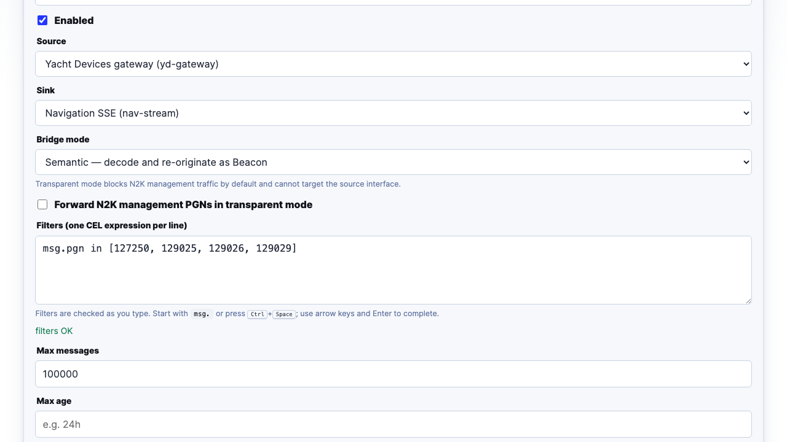
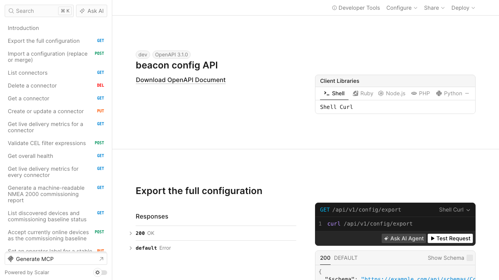

# beacon

[](https://github.com/open-ships/beacon/actions/workflows/test.yaml)
[](go.mod)
[](LICENSE)

An offline-first NMEA 2000 gateway for moving vessel data between CAN,
USB-CAN, HTTP, WebSocket, TCP, MQTT, capture files, and marine gateways.
Beacon adds CEL filtering, durable per-route buffering, replay, live diagnostics,
and one REST API without requiring a cloud service.

## Start here



_A real Beacon instance routing live NMEA 2000 traffic. Sources, connector
routes, sinks, state, throughput, and pending delivery stay visible in one
view._

The quickest local preview needs no CAN hardware. Start Beacon, then open
[http://localhost:2112](http://localhost:2112):

```bash
git clone https://github.com/open-ships/beacon.git
cd beacon
go run ./cmd/beacon \
  --db beacon.db \
  --admin-address 127.0.0.1:2112 \
  --data-address 127.0.0.1:8080
```

This route requires Go 1.25.2 or newer. Prefer a container? The published
image provides the same no-hardware preview:

```bash
mkdir -p data
docker run --rm \
  -p 127.0.0.1:2112:2112 \
  -p 127.0.0.1:8080:8080 \
  -v "$(pwd)/data:/data" \
  ghcr.io/open-ships/beacon:latest
```

Once it is running:

- **Dashboard:** [localhost:2112/ui](http://localhost:2112/ui)
- **Onboard manual:** [localhost:2112/ui/docs](http://localhost:2112/ui/docs)
- **MCP agent reference:** [localhost:2112/ui/mcp](http://localhost:2112/ui/mcp)
- **Interactive API reference:** [localhost:2112/api/docs](http://localhost:2112/api/docs)
- **Health:** [localhost:2112/health](http://localhost:2112/health)

The UI starts empty on purpose. Add a source, a sink, and a connector route
from the dashboard, or import one of the tested configs in [`examples/`](examples/).
Every change is validated, persisted to SQLite, and applied immediately; there
is no separate configuration file to maintain and no restart step.

### See traffic without hardware

On Linux, a virtual CAN interface gives you a complete local route in a few
commands. Stop the preview above if it is still running, install `can-utils`,
then run:

```bash
sudo modprobe vcan
sudo ip link add dev vcan0 type vcan
sudo ip link set vcan0 up

go run ./cmd/beacon \
  --db beacon-vcan.db \
  --seed examples/vcan-dev.json
```

In another terminal, connect the SSE consumer first:

```bash
curl -N http://localhost:8080/events
```

Then inject a frame from a third terminal:

```bash
cansend vcan0 18FF0001#0102030405060708
```

You now have a real route from `vcan0` through Beacon's durable connector
buffer to an SSE client. The source, route, counters, and sink state appear on
the dashboard within a couple of seconds.

> [!NOTE]
> `--seed` is applied only when the selected database has no configuration.
> Reusing a populated database safely keeps its current routes.

## Why Beacon

- **Offline by design.** The UI, manual, API reference, PGN catalog, storage,
  and runtime all work with no internet connection.
- **A legible routing model.** Every message moves through an explicit
  source → connector route → sink topology.
- **Independent durability.** Each connector route owns its own SQLite-backed
  buffer, checkpoint, limits, counters, and delivery boundary.
- **Controlled bridging.** Choose semantic re-origination, transparent
  wire-preserving forwarding, or observe-only inspection per route.
- **NMEA 2000 depth.** Beacon keeps raw bytes and wire values while adding PGN
  metadata, decoded fields, physical units, ingress provenance, stable Device
  NAMEs, device inventory, and commissioning reports.
- **Built for integration.** The UI is a thin layer over a typed REST API with
  an embedded OpenAPI 3.1 reference, RFC 7807 errors, health, and Prometheus
  metrics.
- **Hot configuration.** Valid writes are persisted and reconciled against the
  running graph in the same request; only affected components restart.

## The model

```text
source ──▶ connector route ──▶ sink
            │        │
            │        └─ delivery checkpoint + replay retention
            ├─ CEL filters
            ├─ bridge mode
            └─ durable SQLite buffer
```

A **source** reads NMEA 2000 messages onto Beacon. A **sink** makes messages
available somewhere else. A **connector route** is the only component that
moves data: it names exactly one source and one sink and owns the policy and
delivery state between them. Sources and sinks can be shared by any number of
routes, making fan-out and fan-in explicit rather than implicit.

### Supported endpoints

| Kind | Sources | Sinks | Notes |
|---|---|---|---|
| CAN | `socketcan`, `usbcan` | `socketcan`, `usbcan` | Physical NMEA 2000 buses; SocketCAN is Linux-native |
| HTTP | `http_sse`, `http_ws` | `http_sse`, `http_ws` | SSE and WebSocket ingestion or broadcast; sink clients can replay |
| Gateways | `tcp`, `udp` | `tcp_gateway` | Yacht Devices RAW or Actisense gateway streams |
| Messaging | `mqtt` | `mqtt` | Topic-based ingestion and live publishing |
| Files | `file` | `file` | Replay captures; write rotating `ndjson` or `candump` logs |
| Plain TCP | — | `tcp` | Live NDJSON listener for backend consumers |

### Bridge modes

| Mode | Behavior | Typical use |
|---|---|---|
| `semantic` | Decodes and re-originates messages through Beacon's persistent N2K appliance identity | Normal routing and protocol conversion |
| `transparent` | Preserves priority, PGN, source, destination, and raw payload, including unknown PGNs | Controlled bridge between two SocketCAN segments |
| `observe` | Filters, retains, checkpoints, and measures without writing to the sink | Inspection, recording policy, and dry-run validation |

`transparent` mode currently requires a SocketCAN sink, rejects a source and
sink on the same interface, and blocks address-claim and network-management
PGNs unless `forward_management` is explicitly enabled.

### Filtering with CEL

Filters are [Common Expression Language](https://cel.dev) expressions evaluated
against the canonical `msg` envelope. A route's expressions use AND semantics;
use `||` inside one expression for OR.

```cel
msg.pgn in [127250, 129025, 129026, 129029]
msg.priority <= 3
has(msg.device_name) && msg.device_name == 123456789
```



The connector editor validates filters as you type and provides completions for
envelope fields, PGNs, decoded payload fields, and CEL helpers. The API exposes
the same compiler without persisting a route:

```bash
curl -X POST http://localhost:2112/api/v1/filters/validate \
  -H 'Content-Type: application/json' \
  -d '{"filters":["msg.pgn == 127250","msg.priority <= 3"]}'
```

See the [filter cookbook](internal/ui/docs/04-filters.md) for payload examples,
null handling, physical values, and reusable policies.

## Delivery, buffering, and replay

Beacon decouples source throughput from sink availability. After filtering, a
message is written to the connector route's SQLite buffer; that route advances
its own checkpoint only when it reaches the sink's declared delivery boundary.
A slow or disconnected sink does not block another route using the same source.

| Delivery class | Sinks / mode | Checkpoint advances when… |
|---|---|---|
| Confirmed | SocketCAN, USB-CAN, file, TCP gateway | The local or gateway write succeeds |
| Resumable | SSE, WebSocket | The message is available in the replayable stream |
| Best effort | TCP, MQTT | Dispatch completes; downstream receipt is not claimed |
| Observe only | `observe` bridge mode | Local inspection completes without a sink write |

Each route can bound retained data with any combination of `max_messages`,
`max_age`, and `max_bytes`. With no limits set, `max_messages` defaults to
100,000. Metrics distinguish **pending delivery** after the checkpoint from
**retained history** that has already been acknowledged but remains replayable.

SSE clients resume with `Last-Event-ID`; SSE and WebSocket clients can also use
`?after=<connector>:<sequence>`. A sink shared by multiple routes accepts a
comma-separated cursor such as `?after=nav:104,engine:57`. TCP and MQTT are
live-only.

Confirmed writes use retry with bounded exponential backoff and at-least-once
semantics. An envelope that cannot be encoded for semantic CAN delivery is
counted as skipped and checkpointed so an unknown PGN cannot wedge a route.
Transparent SocketCAN delivery preserves that unknown PGN losslessly.

For the precise retention, pruning, replay, retry, and file-rotation contract,
read [Concepts](internal/ui/docs/03-concepts.md) and
[ADR 0001](docs/adr/0001-route-delivery-boundaries.md).

## The envelope

Every source is normalized into one JSON envelope used by buffers, filters, and
network sinks. Its canonical representation keeps wire truth intact and adds
semantic metadata rather than replacing raw values.

| Field group | What it carries |
|---|---|
| Wire identity | `pgn`, `source`, `dest`, `priority`, `timestamp`, `raw` |
| Route identity | `id`, `connector` after the message enters a route buffer |
| Provenance | `observed_at`, `ingress`, `origin_ingress` |
| Stable device identity | `device_name` and JavaScript-safe `device_name_hex` after address claim |
| Catalog metadata | `pgn_name`, `variant`, `transport`, `manufacturer_code`, `decode` |
| Values | Lossless raw-tick `payload` plus additive unit-scaled `physical` values |

Unknown PGNs still move through HTTP, TCP, MQTT, file, observe, and transparent
routes with their raw bytes. See
[ADR 0004](docs/adr/0004-keep-wire-values-canonical.md) for the compatibility
rationale and [Concepts](internal/ui/docs/03-concepts.md#the-envelope) for the
complete field contract.

## Configuration

The entire desired state is one JSON document:

```json
{
  "sources": [
    {
      "id": "can0",
      "name": "Engine room bus",
      "type": "socketcan",
      "enabled": true,
      "interface": "can0"
    }
  ],
  "sinks": [
    {
      "id": "events",
      "name": "Browser feed",
      "type": "http_sse",
      "enabled": true,
      "path": "/events"
    }
  ],
  "connectors": [
    {
      "id": "navigation",
      "name": "Navigation data",
      "source_id": "can0",
      "sink_id": "events",
      "mode": "semantic",
      "filters": ["msg.pgn in [127250, 129025, 129026, 129029]"],
      "buffer": {"max_messages": 100000},
      "enabled": true
    }
  ]
}
```

Use it in whichever workflow fits:

```bash
# Seed an empty database at boot
beacon --db beacon.db --seed examples/navigation.json

# Replace or merge config on a running Beacon
curl -X POST 'http://localhost:2112/api/v1/config/import?mode=replace' \
  -H 'Content-Type: application/json' \
  --data-binary @examples/navigation.json

curl -X POST 'http://localhost:2112/api/v1/config/import?mode=merge' \
  -H 'Content-Type: application/json' \
  --data-binary @examples/engine-room.json

# Export a running Beacon
curl http://localhost:2112/api/v1/config/export > beacon-config.json
```

Entity-level CRUD is available at
`/api/v1/{sources,sinks,connectors}/{id}`. Deleting a source or sink still in
use returns `409`; structural and CEL errors return an RFC 7807 `422` without
changing the running configuration.

The CLI also provides offline `beacon export` and `beacon import` commands.
Do not use them against a database held open by a running Beacon; use the live
HTTP endpoints instead. Full examples and caveats are in
[`examples/README.md`](examples/README.md).

## API and operational surfaces



Beacon runs separate admin and data servers so a sink configuration cannot
take away the control surface used to repair it.

| Surface | Default location | Purpose |
|---|---|---|
| Dashboard | `:2112/ui` | Route graph, pending/retained state, bus diagnostics, device commissioning |
| Manual | `:2112/ui/docs` | Offline getting started, CAN setup, concepts, filters, API, troubleshooting |
| MCP endpoint | `:2112/mcp` | Streamable HTTP tools for agent configuration, health, and delivery statistics |
| MCP reference | `:2112/ui/mcp` | Embedded connection guide, tool catalog, and call examples |
| REST API | `:2112/api/v1/...` | Configuration, live state, PGN catalog, inventory, commissioning |
| API reference | `:2112/api/docs` | Interactive, embedded OpenAPI 3.1 documentation |
| OpenAPI document | `:2112/api/openapi.json` | Machine-readable discovery for SDKs, scripts, and agents |
| Health | `:2112/health` | Rolled-up component health; mirrored at `/api/v1/health` |
| Metrics | `:2112/metrics` | Prometheus exposition |
| SSE / WebSocket sinks | `:8080/<configured-path>` | Data and replay endpoints |
| TCP sinks | Configured listener address | Live-only NDJSON stream |

An MCP client can connect without a cloud relay or companion process:

```json
{
  "mcpServers": {
    "beacon": {"url": "http://127.0.0.1:2112/mcp"}
  }
}
```

The MCP server exposes nine tools to read the complete configuration, create or
update sources, sinks, and connector routes, delete each entity type, and read
health or delivery statistics. It uses the same validation, SQLite persistence,
and hot reconciliation as the UI and REST API. The server, tool schemas, and
reference page are all embedded in the Beacon binary; no internet connection,
remote schema, CDN, or hosted MCP service is required.

The admin API also exposes the complete PGN and field catalog, best-effort
CAN/USB hardware discovery, stable Device NAME inventory, commissioning
baselines, and a machine-readable commissioning report.

Beacon does not currently provide built-in authentication or TLS. Bind the
admin server to loopback for local use, or place it behind the access controls
appropriate for the vessel network.

## Running in production

Prebuilt archives for Linux, macOS, and Windows on amd64 and arm64 are published
on [GitHub Releases](https://github.com/open-ships/beacon/releases). Physical
SocketCAN operation requires Linux; the other builds remain useful for USB-CAN,
remote streams, development, and administration.

| Flag | Default | Purpose |
|---|---|---|
| `--db` | `beacon.db` | SQLite configuration, appliance identity, inventory, and connector buffers |
| `--data-address` | `0.0.0.0:8080` | Bind address for HTTP sink endpoints |
| `--admin-address` | `0.0.0.0:2112` | Bind address for UI, API, MCP, health, and metrics |
| `--seed` | none | Config loaded into an empty database; ignored after configuration exists |
| `--log-level` | `info` | `debug`, `info`, `warn`, or `error` JSON logs |

For a Linux host with a configured CAN interface, the repository Compose file
uses host networking so the container can see that interface:

```bash
docker compose up
```

Or run the published image with persistent storage:

```bash
docker run --rm --network host \
  -v "$(pwd)/data:/data" \
  ghcr.io/open-ships/beacon:latest \
  --db /data/beacon.db
```

Host networking exposes host network interfaces but not USB device nodes. Pass
the appropriate serial device explicitly when using USB-CAN in a container.
The onboard [CAN setup guide](internal/ui/docs/02-can-setup.md) covers real and
virtual interfaces, permissions, bitrate, Docker, and troubleshooting.

## Architecture

Beacon is a single static Go binary with embedded UI/docs assets and a SQLite
database. Configuration follows one write path whether it begins in the UI,
REST API, seed file, or offline import:

```text
UI / REST / import
        │
        ▼
 validate structure + compile CEL
        │
        ▼
 persist desired config in SQLite
        │
        ▼
 supervisor reconciles changed runtimes

source runtime ─▶ filter ─▶ connector queue ─▶ delivery policy ─▶ sink runtime
                         └──── metrics / replay / checkpoint ────┘
```

Important design invariants:

- One persistent appliance NAME is reused across restarts and independently
  connected bus endpoints.
- Raw wire values remain canonical; physical values and catalog metadata are
  additive.
- Every connector route declares one bridge mode and one delivery class.
- Pending delivery and retained replay history are reported separately.
- The admin and data listeners fail independently.
- All configuration mutations pass through validation, persistence, and
  reconciliation in that order.

The vocabulary in [`CONTEXT.md`](CONTEXT.md) is the shared domain model. Design
decisions are recorded in [`docs/adr/`](docs/adr/), including
[delivery boundaries](docs/adr/0001-route-delivery-boundaries.md),
[appliance identity](docs/adr/0002-persist-one-appliance-identity.md),
[bridge modes](docs/adr/0003-separate-semantic-and-transparent-bridges.md),
and [canonical wire values](docs/adr/0004-keep-wire-values-canonical.md).

### Project layout

```text
cmd/beacon/       CLI entrypoint: serve, export, import
internal/
  app/            composition root and HTTP servers
  api/            typed REST API and embedded OpenAPI reference
  bus/            shared N2K clients per physical endpoint
  config/         validate → persist → reconcile write path
  connector/      subscribe → filter → queue → deliver route runtime
  filter/         CEL environment, compile, and evaluation
  identity/       persistent N2K appliance identity
  inventory/      Device NAME history and commissioning baseline
  model/          sources, sinks, connector routes, validation
  msg/            canonical NMEA 2000 envelope
  queue/          SQLite-backed per-route buffer and checkpoints
  sink/           CAN, HTTP, TCP, MQTT, file, and gateway delivery
  source/         CAN, HTTP, MQTT, file, and gateway ingestion
  stats/          live route counters
  supervisor/     desired-state runtime reconciliation
  ui/             embedded htmx UI and onboard manual
examples/         validated, importable starter configurations
tests/browser/    Playwright end-to-end tests
```

## Development

Common tasks use [just](https://just.systems):

```bash
just build          # local static binary
just test           # all Go tests
just test-race      # full suite with the race detector
just test-browser   # Playwright end-to-end tests
just fmt            # gofmt
just vet            # go vet
just lint           # golangci-lint
just secure         # govulncheck + gosec
just docker-build   # local container image
```

The direct path has no task-runner dependency:

```bash
go test ./...
go build ./cmd/beacon
```

Browser tests start an isolated in-memory Beacon automatically:

```bash
npm ci
npx playwright install chromium
npm test
```

Before changing a domain boundary, read [`CONTEXT.md`](CONTEXT.md) and the
relevant ADR. Before changing an endpoint or configuration shape, update the
API/UI tests and keep the files in [`examples/`](examples/) valid; CI validates
them through the same code path used by real configuration writes.

Issues and pull requests are welcome. The most useful contributions preserve
offline operation, wire fidelity, explicit delivery semantics, and the
source → connector route → sink model.

## License

Beacon is available under the [Apache License 2.0](LICENSE).
